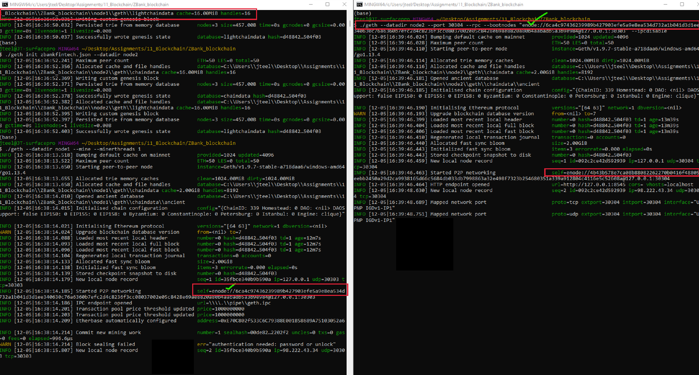
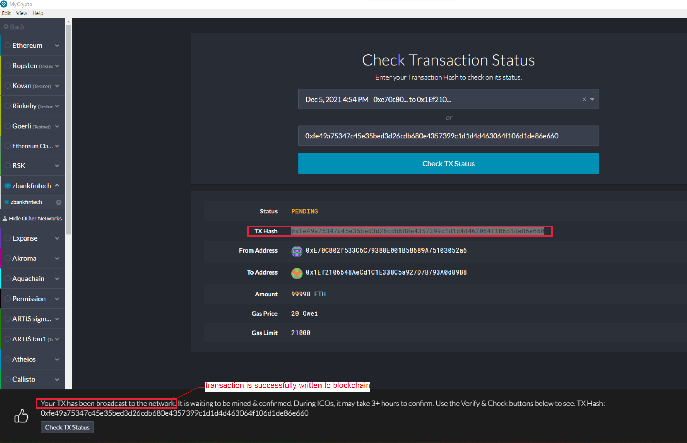
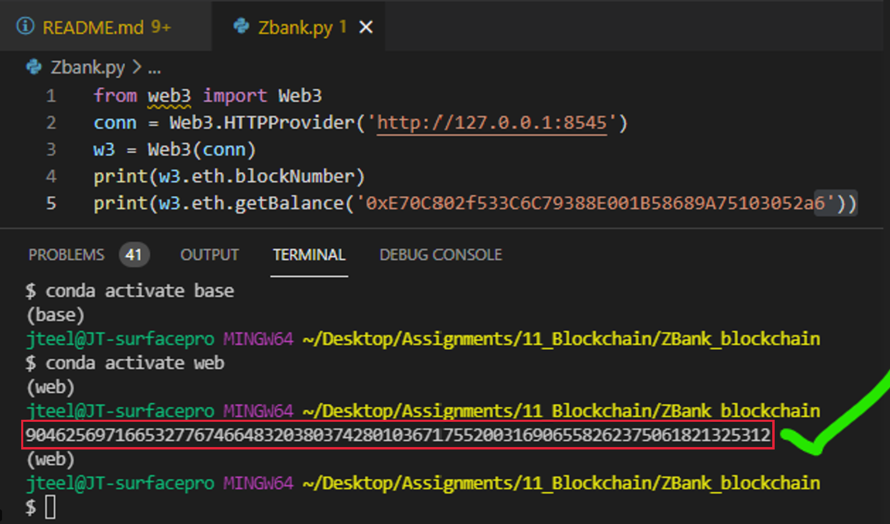

# ZBank Blockchain Procedures:
##### ***Objective: Create private test net and use local nodes to send transaction.***

## User Support#1: 
Create new directory and two sub-directories for each node as seen below:

#### Steps:
        A. ./geth account new --datadir node1
        B. ./geth account new --datadir node2
        C.  Make sure to copy your public address

>## User Support#2: Initialize both nodes:
        A. ./geth init zbankfintech.json node1
        B. ./geth init zbankfintech.json node2
        

## User Support#3: 
Below are the configured network settings:

        A. Network name is 'zbankfintech'
        B. Chain/NetworkID: 339
        C. Using the 'Proof of Authority' model. 
                C1. PoA: This means validator's identify performs the role of stake (vs. PoS)

## User Support#4: 
Run both nodes on your local machine:

####  **Reminder: Initalize node1, copy enode, initialize node2 with node1's enode. Use '--ipcdisable' for Windows**

        A1. ./geth --datadir node1 --mine --minerthreads 1
        B2. ./geth --datadir node2 --port 30304 --rpc --bootnodes "REPLACEWITHNODE1ENODE" --ipcdisable

## User Support#5: 
Create custom network in MyCrypto, login using node1 keystore file, and send transaction to Node2's public address:

### Hints:
#### 1. Make sure the following are TRUE for custom node config:
        A. Network name matches network name from Step 3 (zbankfintech)
        B. Chain ID matches chain/networkID input from Step 3 (339)
        C. Local host is always 'http://127.0.0.1:8545'

Success. Make note of TxHash: 
0xfe49a75347c45e35bed3d26cdb680e4357399c1d1d4d463064f106d1de86e660

# ***That's it! both nodes are now transacting on our local machine***

### You can check your balance with the following commands:

